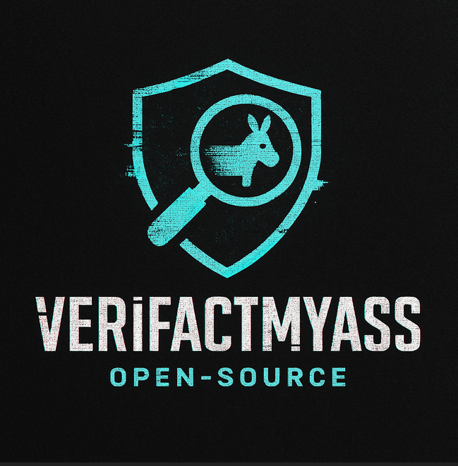

  

# VeriFactMyAss 🕵️‍♂️🔥

> My ass. Let’s verify and debunk that — because not every 'success story' is as true as it sounds. Time to fight back against fake news with facts.

## 🔍 Project Overview

**VeriFactMyAss** is an open-source tool designed to analyze the *factual accuracy* of posts on social media platforms (starting with LinkedIn).  
It uses NLP techniques to extract claimed facts, validates them using online sources, and calculates a **veracity score**.

⚠️ This is a work-in-progress. Community contributions welcome.

---

## 🧠 How It Works (Work on progress - Coming Soon)

1. **Fact Extraction** — NLP models identify key factual statements in a given post.
2. **Fact Validation** — Each fact is cross-checked using:
   - Google Fact Check API
   - Public databases
   - Trusted media / crowdsourced intelligence
3. **Scoring** — A reliability score is calculated:
   
4. **Report Generation** — A structured report is generated (JSON, PDF or CLI output).

---

## 🌍 Why This Matters

Misinformation spreads faster than facts — especially on platforms where engagement is king and critical thinking is... optional.  
VeriFactMyAss is built for those who are tired of reading viral nonsense, humblebrag lies, and motivational garbage dressed up as truth.

Let’s give OSINT, fact-checkers, educators and skeptical readers the tools to push back — with data, with logic, and with style.

---

## 👾 Coming Next

- [ ] NLP pipeline for fact extraction  
- [ ] Integration with fact-check APIs  
- [ ] Browser extension prototype  
- [ ] Community-driven flagging system  
- [ ] Web dashboard for result sharing  

---

## 🤝 Contribute

Want to help us build a smarter web?

- Clone the repo  
- Check the issues  
- Build something cool  
- Or just fix our typos — we’ll still love you

All contributions are welcome: code, design, ideas, docs, coffee ☕

---

## ⚖️ License

This project is licensed under the MIT License.  
Use it, fork it, break it, remix it. Just don’t lie with it 😉

---

## ✊ Philosophy

> “Facts do not cease to exist because they are ignored.”  
> — Aldous Huxley

> VeriFactMyAss exists to make ignoring facts a little harder — and a lot more awkward.
This tool is part of a broader digital and informational resistance, built to combat misinformation, cognitive warfare, and foreign interference campaigns orchestrated by hostile state actors.
Together, let’s save the web — one debunked lie at a time.

